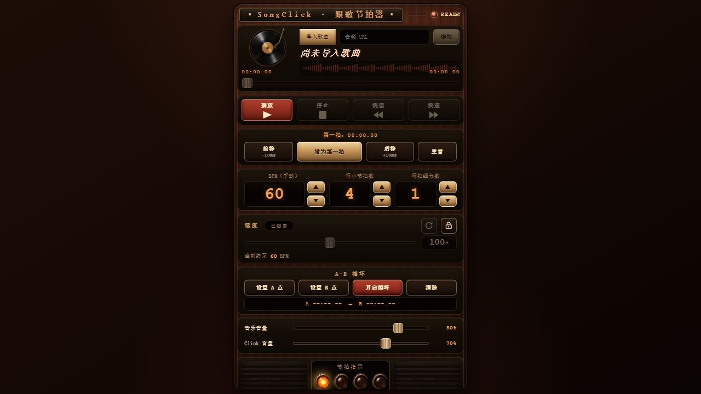

# SongClick

让歌曲和节拍器保持同步的纯前端音乐练习工具。

SongClick 使用同一个 Web Audio API 时钟播放本地歌曲和 click，适合需要降速练习、定位第一拍、细分节拍或反复练习片段的乐手。音频处理全部在浏览器中完成，无需上传本地文件。



## 功能

- 导入浏览器支持的本地音频，例如 MP3、WAV、M4A 和 OGG
- 读取允许跨域访问的直接音频 URL
- 手动设置 BPM、每小节拍数与每拍细分数
- 在歌曲当前位置校准第一拍，并以 10 ms 步长微调
- 以 50%–150% 的速度练习，并显示换算后的练习 BPM
- 设置 A–B 循环，分别调节音乐与 click 音量
- 按曲目在浏览器 `localStorage` 中保存练习配置

## 快速开始

需要 [Node.js](https://nodejs.org/) 20.19 或更高版本。

```bash
git clone https://github.com/CyberMoss/SongClick.git
cd SongClick
npm ci
npm run dev
```

生产构建：

```bash
npm run build
npm run preview
```

## 使用方法

1. 点击“导入歌曲”选择本地音频，或填入可直接访问的音频文件 URL。
2. 填写歌曲的 BPM、每小节拍数和需要的细分数。
3. 播放歌曲，在第一拍到来时点击“设为第一拍”；必要时用 ±10 ms 按钮微调。
4. 解锁速度控制进行降速练习，或设置 A、B 点反复练习一个片段。

## 隐私与限制

- 本地音频不会上传到服务器，文件只在当前浏览器标签页内解码。
- 练习配置保存在当前浏览器本地；清理站点数据会删除这些配置。
- URL 导入会由浏览器直接请求目标地址，因此目标服务器必须允许跨域访问。
- 不支持 YouTube、Bilibili、网易云音乐、QQ 音乐、Spotify 等平台页面链接。
- BPM 和第一拍目前需要手动设置。

## 技术栈

- React 18
- TypeScript
- Vite
- Web Audio API

## 参与贡献

欢迎提交 issue 和 pull request。开始前请阅读 [CONTRIBUTING.md](CONTRIBUTING.md)；安全问题请按 [SECURITY.md](SECURITY.md) 中的方式报告。

## 许可证

代码与仓库内自有素材采用 [MIT License](LICENSE)。界面素材的生成与授权说明见 [ASSETS.md](ASSETS.md)。
